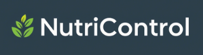

## 🥗 Organiza y Controla Tu Semana Nutricional

**NutriControl** es una aplicación web interactiva diseñada para ayudarte a planificar, seguir y visualizar tu progreso semanal en cualquier área que necesites organizar, con un enfoque especial en hábitos nutricionales y de bienestar. Es la herramienta perfecta para mantener un registro visual de tus metas y actividades diarias.

## ✨ Características Principales

* **Calendario Semanal Interactivo**: Una vista clara y sencilla de tu semana, permitiéndote registrar actividades día a día.
* **Categorías Personalizables**: Organiza tus entradas bajo categorías predefinidas como Almuerzo, Cena, Couta de placer, etc., cada una con su propio ícono y color para una fácil identificación.
* **Registro Detallado**: Para cada celda del calendario (día y categoría), puedes:
    * Añadir **notas y comentarios** específicos.
    * Subir **imágenes** relevantes (ej. fotos de comidas, progreso físico). Las imágenes se redimensionan para optimizar el rendimiento y la visualización.
    * Marcar tareas como **"completadas"** para visualizar tu avance de un vistazo.
* **Generación de PDF**: Convierte tu semana organizada en un documento PDF descargable. Ideal para compartir con tu nutricionista, entrenador, o simplemente para tus registros personales.
* **Seguimiento de Progreso**: Un indicador visual te muestra cuánto has avanzado en tus metas semanales, motivándote a completar tus objetivos.
* **Diseño Responsivo**: Disfruta de una experiencia de usuario fluida tanto en dispositivos de escritorio como móviles.

## 🚀 Tecnologías Utilizadas

* **React**: La base de la interfaz de usuario, garantizando una experiencia dinámica y moderna.
* **TypeScript**: Añade tipado estático, mejorando la robustez, mantenibilidad y escalabilidad del código.
* **Tailwind CSS**: Para un desarrollo rápido y eficiente de estilos.

## 🤝 Contribuciones

¡Las contribuciones son bienvenidas! Si tienes ideas para mejorar **NutriControl**, siéntete libre de abrir un *issue* o enviar un *pull request*.

## 📜 Licencia

Este proyecto está bajo la Licencia MIT. Consulta el archivo `LICENSE` para más detalles.

## 📧 Contacto

¿Preguntas o sugerencias? No dudes en contactarme a través de [e.m.morenolp@gmail.com](mailto:e.m.morenolp@gmail.com) o mi perfil de GitHub.